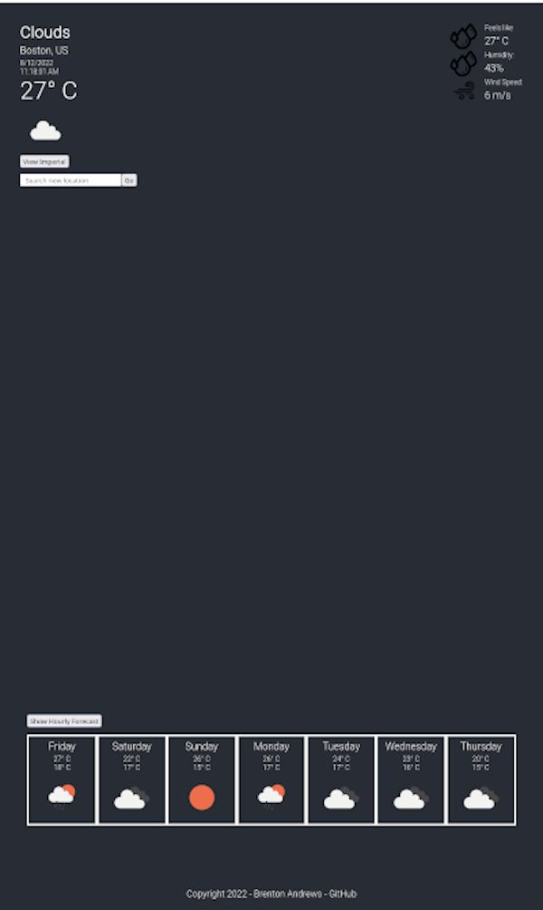

# React Weather App

View the project live [here](https://brenton-j-andrews.github.io/React_Weather_App/).

-----
#### About this project.

Completed for [The Odin Project](https://www.theodinproject.com/lessons/node-path-javascript-weather-app) JavaScript Course.

Originally, I created this project in vanilla JS, but after going a while without getting any practice with React I decided to recreate it to get more practice in with the framework.

The original project served as an introduction to asynchronous javascript and working with API's. I am fairly familiar with these concepts now but some extra practice is always good!

-----

#### Frameworks

This project was built using React and Axios for fetching API data.

-----

#### Takeaways

This project gave me some experience with asynchronous programming in React, indroduced me to the Axios client, and gave me a better understanding of CSS horizontal scrolling for the hourly forecast data display.

I need to learn some more about error handling when chaining API calls together (and error handling in general), styling browser scrollbars (spent a good amount of time trying to figure this out without any luck...) and best practices in React. 

-----

#### Todo

- Learn more about insecure / mixed content. The deployed application is logging this as a warning.
- Improve styling for longer monitors.
- Add a higher resolution image for the README.
